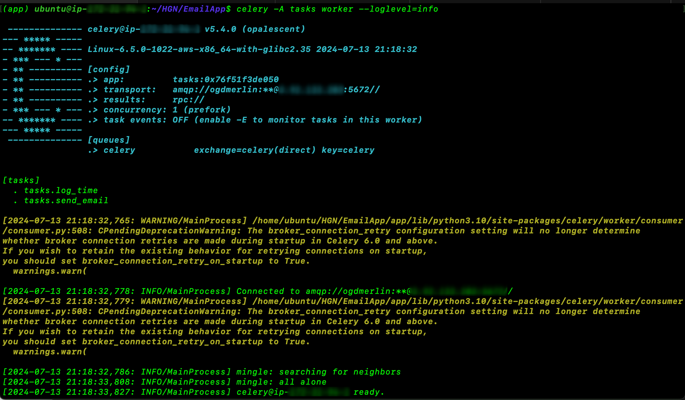
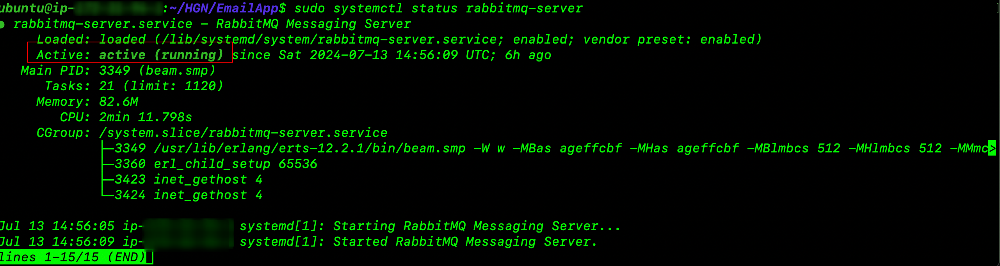
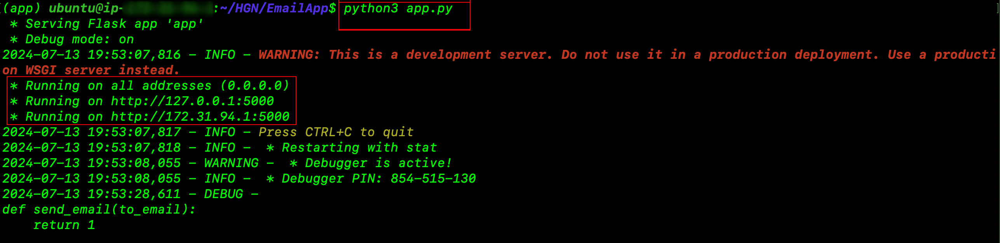

## Flask + Celery + RabbitMQ-Server Messaging Application

#

**Messaging System Overview**

The Messaging System application is designed to facilitate email sending and logging operations through a Flask web interface and Celery task queueing system. It allows users to send emails asynchronously and log timestamps, ensuring efficient task management and logging capabilities.

#

**Features**

#

Email Sending:

Users can send emails by making HTTP requests to the Flask application endpoint (/).

Emails are sent asynchronously using Celery tasks, ensuring minimal impact on application responsiveness.

Emails are sent using the provided email credentials (EMAIL, PASSWORD) and SMTP server configuration.

#

Logging:

The application logs timestamps whenever the `/task_status/<task_id>` endpoint is accessed.

Logs are stored in `/var/logs/messaging_system.log`, providing a centralized location for monitoring application activities.

#

Task Management:

Users can check the status of email sending tasks by accessing the `/task_status/<task_id>` endpoint.

Task statuses include PENDING, SUCCESS, or FAILURE, providing real-time feedback on task execution.

#

**Setup and Usage**

Environment Setup:

Clone the repository and install dependencies using;

```pthon
pip install -r requirements.txt.
```

Set up environment variables in a .env file for configuration (e.g., `EMAIL, PASSWORD, SMTP_SERVER, SMTP_PORT)`.

Start the Celery task queueing;

Start the Celery worker;

```sh
celery -A tasks worker --loglevel=info
```



Start the RabbitMQ server

```sh
sudo systemctl start rabbitmq-server
```



Configure the RabbitMQ server for Celery by creating a user, vhost, and setting permissions;

```sh
sudo rabbitmqctl add_user myuser mypassword
sudo rabbitmqctl set_user_tag myuser
sudo rabbitmqctl set_permissions -p myvhost myuser ".*" ".*" ".*"
```

#

**Running the Application:**

```python
Start the Flask application: python app.py.
```



Accessing the Application:

```
localhost:5000/?sendmail=<email_address> to send an email.
```

The application runs locally by default. Use Ngrok to expose it publicly for testing or demonstration purposes.

Endpoints:

Send Email: GET /?sendmail=<email_address>
Queues an email sending task to the Celery worker.
Log Time: GET /?talktome=true
Logs the current timestamp to /var/logs/messaging_system.log.
Monitoring Tasks:

Check task status: GET /task_status/<task_id>
Returns the status (PENDING, SUCCESS, FAILURE) of the specified task.
Security Considerations
Ensure sensitive information such as email credentials (EMAIL, PASSWORD) are securely stored and not exposed in code repositories.
Use Ngrok carefully to expose the application to the internet, ensuring proper access controls and monitoring.
Dependencies
Flask: Web framework for building the HTTP endpoints.
Celery: Distributed task queueing system for handling asynchronous tasks.
Python-dotenv: For loading environment variables from a .env file.
Ngrok: Utility for exposing local servers to the internet via secure tunnels.
Future Improvements
Implement error handling and retry mechanisms for email sending tasks.
Enhance logging with additional metadata for better traceability and debugging.
Conclusion
The Messaging System application leverages Flask and Celery to provide robust email sending and logging functionalities. It is designed to be scalable and adaptable, supporting various use cases from basic email notifications to complex task scheduling and management.
